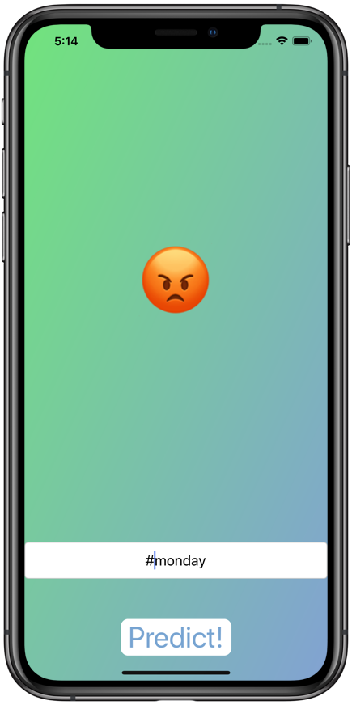

# Twittermenti

&nbsp;&nbsp;&nbsp;&nbsp;&nbsp;&nbsp;&nbsp;&nbsp;&nbsp;&nbsp;

# My Goal

The goal of this application is to give users the ability see Twitter users' sentiments by searching Twitter handles and hashtags, and rendering an emoji based on the Twitter users' tweets and hashtag usage.  The sentiments are based on Machine Learning model.

## What I created

Twittermenti is a super fun app that searches for negative, positive, or neutral sentiments of Twitter handles and Twitter hashtags.  Twittermenti then takes the search query and turns the findings, using the machine learning model, into emojis that emote the nature of the search.  

## What I learned

* How to better use the Twitter API.
* Further enhance my understanding of object oriented programming.